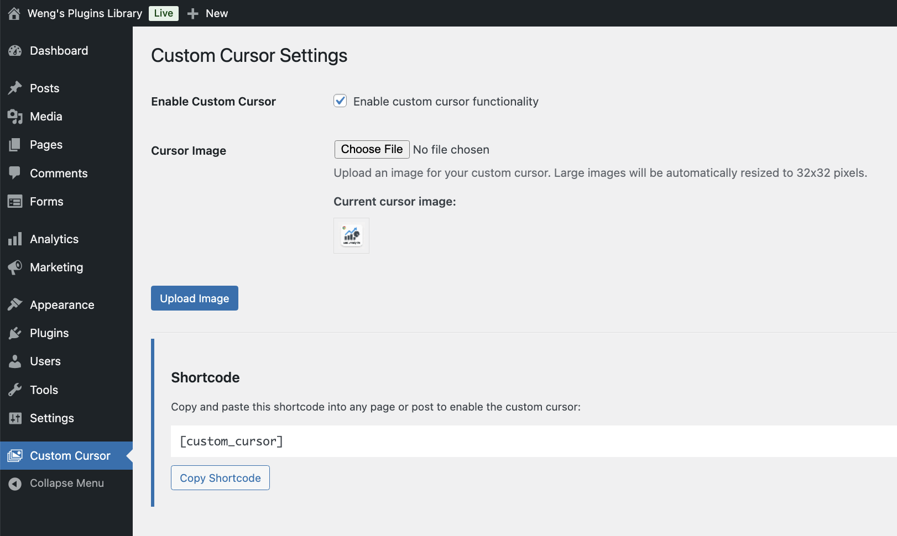

# Custom Cursor Plugin for WordPress

## Summary

**A WordPress plugin for custom animated cursor images with a beautiful modern interface.** Upload any image through an intuitive card-based admin UI with automatic optimization to your chosen size (16-64px). Apply custom cursors with animations (pulse, spin, bounce, shake, glow), visual effects (blend modes, shadows), and click interactions to any page using the `[custom_cursor]` shortcode. Features progressive disclosure for advanced options, real-time color picker, one-click shortcode copying with visual confirmation, and a streamlined single Save Settings button for an intuitive workflow.

**For Developers:** See [`context.md`](context.md) for technical architecture, code flow, and extension guides.

---


<a target="_blank" href="https://github.com/Siphon880gh" rel="nofollow"></a>
<a target="_blank" href="https://www.linkedin.com/in/weng-fung/" rel="nofollow"></a>
<a target="_blank" href="https://www.youtube.com/@WayneTeachesCode/" rel="nofollow"></a>

By Weng Fei Fung (Weng). A WordPress plugin that allows you to upload a custom cursor image and display it on any page using a shortcode.



## Features

- **Beautiful modern admin interface** with card-based layout and gradient styling
- Upload custom cursor images through WordPress admin
- **Multiple cursor sizes:** Choose from 16x16, 24x24, 32x32, 48x48, or 64x64 pixels
- **Six animation types:** Pulse, Spin, Bounce, Shake, Glow, or None (static)
- **Advanced animation controls:**
  - Customizable speed (0.5s-3s)
  - Loop control (infinite or single-play)
  - Click animation (pulse on mouse click)
- **Visual effects:**
  - Blend modes (Normal, Multiply, Screen, Overlay, Difference, Exclusion)
  - Drop shadow with custom color picker
- **Progressive disclosure UI** - Advanced options collapse/expand for cleaner interface
- Automatic image resizing based on selected size
- Enable/disable functionality with a simple toggle
- Easy-to-use shortcode for displaying custom cursor on any page
- One-click shortcode copying with visual confirmation
- Organized Save Settings button at bottom for intuitive workflow

## Installation

1. Upload the `custom-cursor-plugin.php` file to your WordPress plugins directory:
   - `/wp-content/plugins/custom-cursor/`

2. Activate the plugin through the 'Plugins' menu in WordPress

3. Navigate to 'Custom Cursor' in the WordPress admin menu

## Usage

### Step 1: Basic Setup

1. Go to **Custom Cursor** in the WordPress admin menu
2. Check "Enable custom cursor functionality" to activate the plugin
3. Upload an image file (any size - it will be automatically optimized)
   - Click "📤 Upload Image" right next to the file selector
4. Select your preferred **cursor size** (16px to 64px, default is 32px ⭐)

### Step 2: Configure Animations (Optional)

1. Choose an **animation type** from the dropdown (Pulse, Spin, Bounce, Shake, Glow, or None)
2. Click "Advanced Animation Options" to expand additional settings:
   - Select animation speed (⚡ Fast to 🦥 Very Slow)
   - Toggle "Loop animation continuously" for infinite animation
   - Enable "Pulse on click" for click interaction feedback

### Step 3: Add Visual Effects (Optional)

1. Click "Advanced Visual Effects" to expand styling options:
   - Choose a **blend mode** for creative color mixing effects
   - Enable **drop shadow** and pick a custom color for depth

### Step 4: Save and Get Shortcode

1. Click the large "💾 Save All Settings" button at the bottom of the page
2. You'll see a success message confirming all settings were saved
3. The shortcode will appear in a dedicated card:
   ```
   [custom_cursor]
   ```
4. Click "📋 Copy Shortcode" for one-click copying
5. Paste the shortcode into any WordPress page or post where you want the custom cursor

## How It Works

- The shortcode applies the custom cursor to the entire page when activated
- **For static cursors:** Uses CSS `cursor` property with your image URL
- **For animated cursors:** Creates a floating div element that tracks mouse movement
- All animations use CSS3 keyframes for smooth performance
- Visual effects (blend modes, shadows) are applied via CSS filters
- Click animations respond to mousedown/mouseup events
- Falls back to default cursor if the custom image fails to load

## Requirements

- WordPress 5.0 or higher
- PHP 7.0 or higher
- GD or ImageMagick library (usually included with WordPress)

## Browser Compatibility

The custom cursor feature is supported in all modern browsers:
- Chrome/Edge
- Firefox
- Safari
- Opera

## Troubleshooting

**Cursor not changing:**
- Make sure the plugin is enabled in settings
- Verify the shortcode `[custom_cursor]` is on the page
- Check that the image uploaded successfully
- Try a different image format (PNG works best for cursors)

**Image too large:**
- The plugin automatically resizes images, but smaller source images work better
- Recommended: Upload images close to your selected size for best quality

**Animation not working:**
- Verify an animation type other than "None" is selected
- Check that the page has fully loaded
- Try a different animation type to isolate the issue
- Ensure JavaScript is enabled in the browser

**Cursor appears too large/small:**
- Adjust the cursor size setting (16px-64px options available)
- Re-upload the image after changing the size setting

## Technical Details

- **Cursor Sizes:** Five preset options from 16x16 to 64x64 pixels
- **Image Formats:** Supports JPG, PNG, GIF, WEBP (including animated GIFs)
- **Animation Engine:** CSS3 keyframe animations with JavaScript mouse tracking
- **Animation Types:** 
  - Pulse (scale effect)
  - Spin (rotation)
  - Bounce (vertical movement)
  - Shake (horizontal movement)
  - Glow (opacity + drop-shadow)
  - None (static)
  - Click animation (pulse on mousedown)
- **Visual Effects:**
  - CSS blend modes for creative color mixing
  - Drop shadow with customizable RGB color
  - Dynamic filter application
- **UI/UX Features:**
  - Card-based admin interface with gradient headers
  - Progressive disclosure (collapsible advanced sections)
  - Real-time color picker with hex code display
  - Visual feedback for all actions
  - Single unified Save Settings button
- **Performance:** 
  - Uses `pointer-events: none` to avoid interaction interference
  - CSS transforms for hardware-accelerated animations
  - Efficient event delegation
- **WordPress Integration:** 
  - Media library for image management
  - Options API for settings storage (11 options total)
  - Security best practices (nonces, capability checks)
  - Automatic input sanitization

## License

GPL v2 or later

